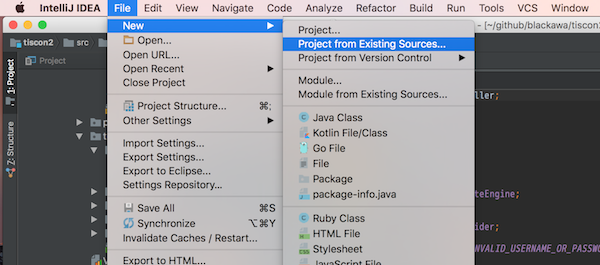
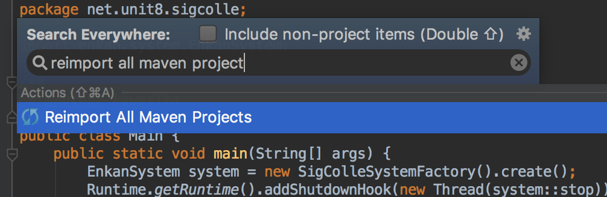

#QA一覧

***
* [mvnが正常に動作しない (mvn --versionコマンドが失敗する)](#mvnが正常に動作しない-mvn---versionコマンドが失敗する)
* [IntelliJでのプロジェクトのcloneができない](#intellijでのプロジェクトのcloneができない)
* [IntelliJのフォルダ表示と実際のフォルダ表示が違う](#intellijのフォルダ表示と実際の内容が違う)
* [動作確認していると ClassCastException が出る](#動作確認していると-classcastexception-が出る)
* [パッケージ enkan.system がありません](#パッケージ-enkansystem-がありません)

***

## Windowsマシンで `mvn --version` コマンドが失敗する

* エラー例①<br>

* エラー例②<br>


JDKまたはMavenの環境変数設定が誤っている可能性があります。
JDK,Mavenをインストールしたディレクトリと環境変数が一致しているかを確認してみてください。
(環境変数に指定しているディレクトリが実際に存在しているか確認してください)

### JDKの環境変数設定
1. システム環境変数『Path』 (例) `C:\Program Files\Java\jdk1.8.0_121\bin`
1. システム環境変数『JAVA_HOME』 (例) `C:\Program Files\Java\jdk1.8.0_121`

> **【補足】**
> * ユーザー環境変数とシステム環境変数の両方に同じ変数名で値が設定されている場合、ユーザー環境変数の値が優先されてしまいます。ユーザー環境変数に『JAVA_HOME』が存在する場合、そちらは削除してください。
> * 環境変数『Path』だけはユーザー変数がシステム変数を上書きせず、両方の値が「;」で連結された設定となります。

### Mavenの環境変数設定
1.システム環境変数『Path』
　　例)C:\Program Files\apache-maven-3.2.5\bin

> **【補足】**
> * 環境構築手順に記載しているように、ダウンロードしたMavenは「C:\Program Files」に格納してください。そうした場合、Pathの変数値は上記例の通りになります。

## IntelliJでのプロジェクトのcloneができない
下記の問題である可能性があります。確認してみてください。

### URLの入力誤り
Git Repository URLに入力しているURLが正しいかを確認してください。
入力するURLは `https://github.com/[Githubのユーザ名]/tiscon2.git` です。

### 自身のGithubアカウントでのプロジェクトForkができていない
Githubにログインし、[GitHubトップページ](https://github.com/)を見てtiscon2のforkができているかを確認してください。
forkができていれば、リポジトリ一覧に「tiscon2」が表示されます。


forkできていなかった場合は、もう一度環境構築手順に従いプロジェクトのforkを行って下さい。

### Gitインストールが完了していない
コマンドプロンプトで `git --version` と入力し、gitのバージョン情報が表示されるか確認してください。
表示されない場合、Gitのインストールに失敗しています。Gitのインストールを行ってください。

## IntelliJのフォルダ表示と実際の内容が違う
cloneが成功すると、 [tiscon2のトップページ](https://github.com/tiscon/tiscon2) に表示されるのと同じ、数個のフォルダとファイルが手に入ります。

しかしIntelliJに表示される内容がそれに沿わないことがあります。その時は以下を順番に確認してください。

### エクスプローラー(またはFinder)で該当のフォルダを表示した時、中身が入っているか？
入っていなければcloneに失敗しています。フォルダを消して、再度cloneしてみましょう。

### フォルダを表示すると中身が入っているのにIntelliJでは見られない
IntelliJがフォルダを読み込むのに失敗しています。再度読み込みましょう。

IntelliJの `File` > `New` > `Project from Existing Sources` を選択して、エクスプローラー(またはFinder)で確認したフォルダを開いて `Open` をクリックします。



表示される手順に従って進みます。`Project File already exists` と言われたら、上書きを選びましょう。
プロジェクトが開いたら、IntelliJがフォルダを読み込むのを待ってから再度フォルダ構成を確認してください。

## 動作確認していると ClassCastException が出る
tiscon2が使っている別プログラムが読み込めていないかもしれません。プログラムをリフレッシュしましょう。

1. IntelliJを開いてください。
1. Shiftキーを2回カチカチッと叩くと、検索窓が表示されます。そこに「reimport all maven projects」と入力すると、そのような選択肢が出るのでそれを選択してください。
1. IntelliJ の画面右下に「Resolving Maven Dependencies...」というようなメッセージと一緒に進行度合いを示すバーが表示されるので、それが消えるまで待ってください。
1. これでプログラムの再読込ができました。再度動作確認をしてみてください。

### 解決しない場合
スタッフに問い合わせてください。その際、

* 環境構築手順の各手順の、「インストールできたら」のステップの実行結果をスクリーンショットもしくはテキストとしてコピペして教えてください。
* 表示されたメッセージが見えるIntelliJの画面のスクリーンショットを撮影してください。
* Shiftキーを2回叩いて出てきた検索窓に「Terminal」と入力して出てきた結果を選択し、表示されたTerminalタブに 「mvn clean install」と入力してEnterしてください。その結果出てきたメッセージをすべてコピーして、テキストファイルに貼り付けて添付してください。

## パッケージ enkan.system がありません
tiscon2は様々なすでにできあがってるプログラムをダウンロードして使用しています。「パッケージ enkan.system がありません」のエラーは、それらがダウンロードできていない時に発生します。以下の順番で作業してみてください。

### 再度ダウンロードを試みる(IntelliJから)
[動作確認していると ClassCastException が出る](#動作確認していると-classcastexception-が出る)と同様に `Reimport All Maven Projects` してみてください。
解決したらこれで終わりです。

### プロジェクトのビルド(IntelliJから)
エラーが解決しない場合、tiscon2自体をリロードしてみましょう。IntelliJのプロジェクトツリーを右クリックして `Rebuild Module 'sigcolle'` をクリックしてください。


その後、前の手順である `Reimport All Maven Projects` を試してください。解決したらこれで終わりです。

### 再度ダウンロードを試みる(コマンドライン)
エラーが解決しない場合、プログラムのダウンロードを別の方法で試します。

IntelliJで `Shift` キーを2回連続でカチカチッと押します。すると検索窓が表示されるので、


そこに `terminal` と入力します。


`Terminal` が検索結果に出てくるので、選択してください。するとコマンドラインの画面が表示されるので
```sh
mvn clean install
```
と入力します。

BUILD SUCCESSと表示されたら、前の手順の `Rebuild module 'sigcolle'` と `Reimport All Maven Projects` してみてください。
解決したらこれで終わりです。

BUILD FAILUREと表示された場合、表示されたすべての内容をコピーして添付し、スタッフに問い合わせてください。
