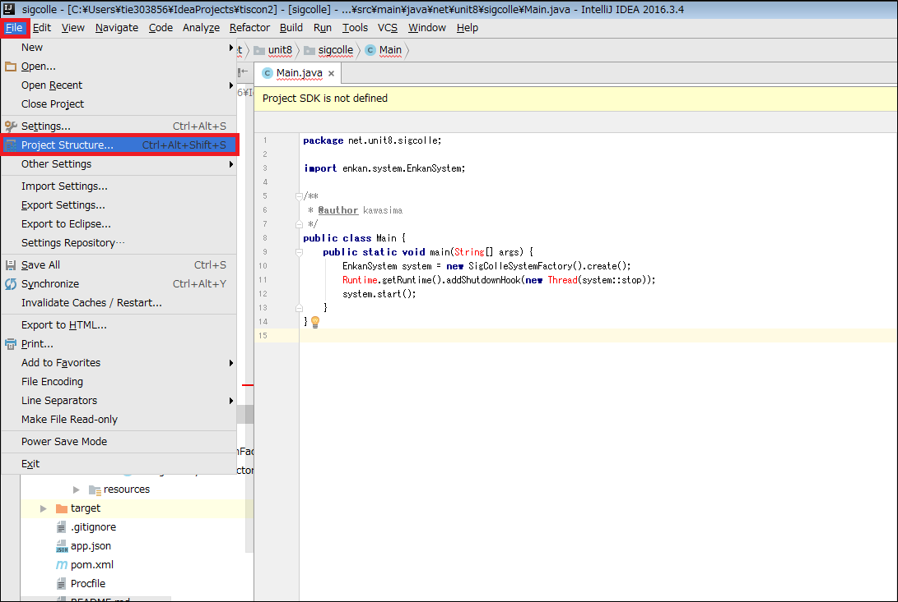
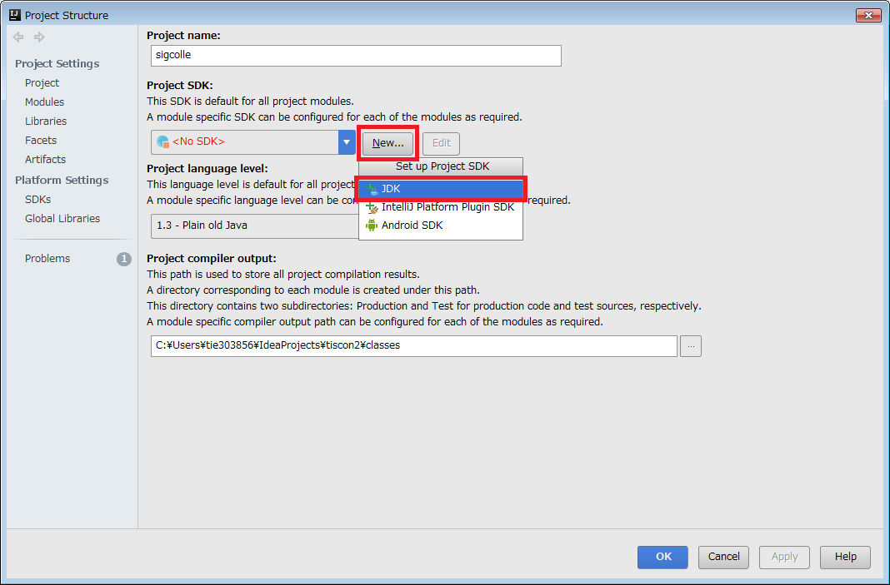
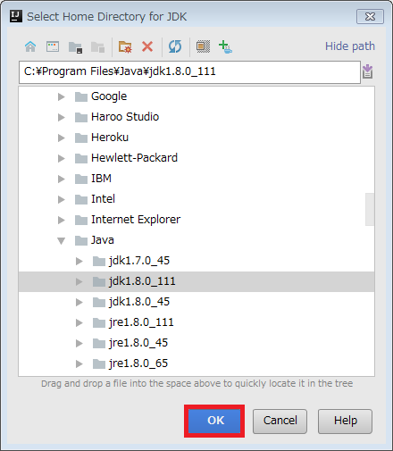
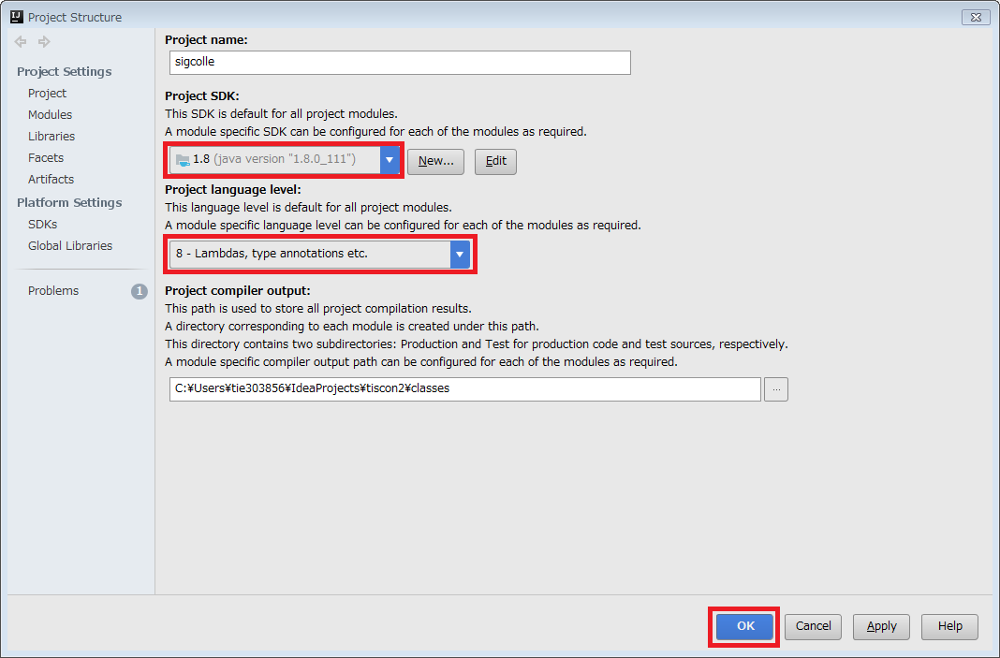

# IntelliJのインストール(Windows)

## 前提条件

* [コマンドプロンプトを起動](tipsForWin.md#コマンドプロンプトの起動方法)して `java -version` とコマンドを入力した時、結果が返ってきますか？
* [コマンドプロンプトを起動](tipsForWin.md#コマンドプロンプトの起動方法)して `mvn --version` とコマンドを入力した時、結果が返ってきますか？
* [あなたはプロキシ環境下で作業していますか？](preparationForWin.md#自分がプロキシ環境下にいるか知っておく)

## インストール

1. https://www.jetbrains.com/idea/#chooseYourEdition のDOWNLOADボタンから、**Community** のバージョンを選んでダウンロードしてください。
1. ダウンロードできたインストーラーを起動して、表示される手順に従ってインストールを進めてください。よくわからない項目はそのままYESを選択してください。

IntelliJを日本語化したい場合は、[IntelliJ IDEA 日本語化 | Qiita](http://qiita.com/makoto2468/items/6abf614b82cab865b745)が参考になります。

## プロキシの設定

プロキシ環境下で作業している場合、以下の手順でプロキシを設定してください。

1. IntelliJのWelcome画面(または `メニューバー > File` )からSettingsを選択します。

1. Settingsウィンドウが表示されるので、左のバーから `Appearance & Behavior > 一般 > HTTP Proxy` を選択します。

1. 「HTTPプロキシを使用する」を選択し、各自の設定を記載します。

1. 下部OKボタンを押下します。

## プラグインの設定

1. もし起動していなかったらスタートメニューやデスクトップに追加されるアイコンからIntelliJを起動し、`Configure` > `Settings` を選択します。

1. Settingsウィンドウが表示されるので、左のバーからPluginsを選択し、 `Browse repositories...` ボタンを押下します。

1. 検索バーに `Lombok` と入力し、Lombok Pluginを選択します。
右側に表示されるInstallボタンを押下してください。

## SDKの設定

1. [File]→[Project Structure...]を選択してください。

1. [Project SDK]という見出しの下にあるプルダウンが＜No SDK＞になっていると思いますので、【New...】→【JDK】を選択してください。

1. ご自身がインストールしたjdkの場所(C:\Program Files\Java\jdk1.8.x_xxx)を選択して[OK]を押下してください。

1. Project SDKが設定され、【1.8(java version "1.8.x_xxx")】が選択されるかと思います。  
一つ下の項目「Project language level」は「8 - Lambdas, type annotations etc.」を選択し、[OK]を押下してください。

