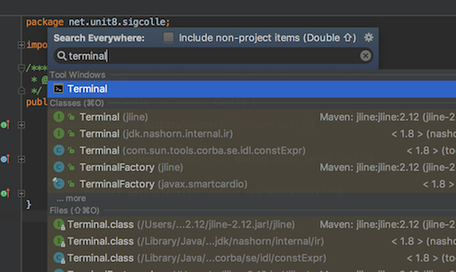
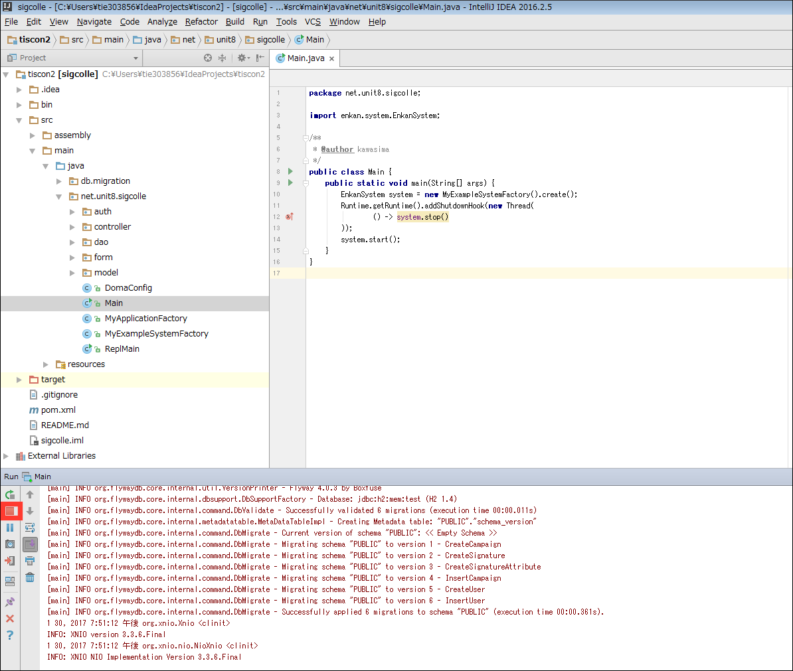

# 自分のPCでtiscon2を動かす

## 前提条件

* [Terminalを起動](tipsForMac.md#terminalの起動方法)して `java -version` とコマンドを入力した時、結果が返ってきますか？
* [Terminalを起動](tipsForMac.md#terminalの起動方法)して `mvn --version` とコマンドを入力した時、結果が返ってきますか？
* [Terminalを起動](tipsForMac.md#terminalの起動方法)して `git --version` とコマンドを入力した時、結果が返ってきますか？

## IntelliJでプロジェクトをcloneする

1. ユーザフォルダ配下に `IdeaProjects` フォルダを作成します。(例) `/Users/ユーザ名/IdeaProjects`
1. IntelliJを起動し、 `Check out from Version Control > Git` を選択します。
1. Git Repository URLに `https://github.com/[Githubのユーザ名]/tiscon2.git` を入力します。
1. Cloneボタンを押下します。「The parent path～」と表示されている場合、Parent Directory項目右の `...` ボタンを押下し、作成した `IdeaProjects` フォルダを選択してください。
1. 画面下部にステータスが表示されます。バーの表示が消えればcloneは完了です。下図のような画面が表示された場合、『No』を選択し、下記の手順に従ってcloneしたプロジェクトを開いてください。


## プロジェクトを開く

プロジェクトのclone時に自動的にプロジェクトが開いた場合、以下の手順は飛ばしてください。

1. IntellijのWelcome画面からOpen を選択します。


1. `/Users/ユーザ名/IdeaProjects/tiscon2` を選択し、OKを押します。


1. tiscon2プロジェクトが開けました。続いてソースコードを確認できるようにします。


## ソースコード確認

1. IntelliJ上部メニューバーから、`View > Tool Windows > Project` を選択します。


1. Project Viewよりプロジェクト内のソースコードが確認できるようになりました。


## [Git](https://git-scm.com/)の設定

今後の作業内容をあなたのGitHubアカウントに紐付けられるようにします。

IntelliJを起動して、 `Shift` キーを2回連続で押します。すると検索窓が表示されるので、


そこに `terminal` と入力します。



`Terminal` が検索結果に出てくるので、選択してください。するとTerminalの画面が表示されるので
```sh
git config user.name GitHubのユーザー名
git config user.email GitHubのメールアドレス
```
を入力してください。
コマンド実行後、何もエラーメッセージが表示されなければ設定完了です。


## ローカルでの動作確認
cloneしたwebアプリケーションが正常に動くか、ローカル上で動作確認を行います。

1. Project Viewから `Main.java` を選択し、右クリックメニューから `Run 'Main main()'` を実行します。


1. 画面下部にログが表示されます。起動が完了すると下図のようにログが表示されます。
起動後はブラウザから [http://localhost:3000](http://localhost:3000) にアクセスすることでトップページが開きます。


1. 動作が確認できたらアプリケーションを終了しましょう。ウィンドウ左下の停止ボタンを押します。

